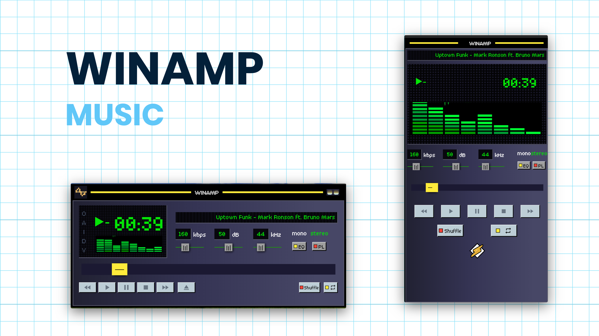
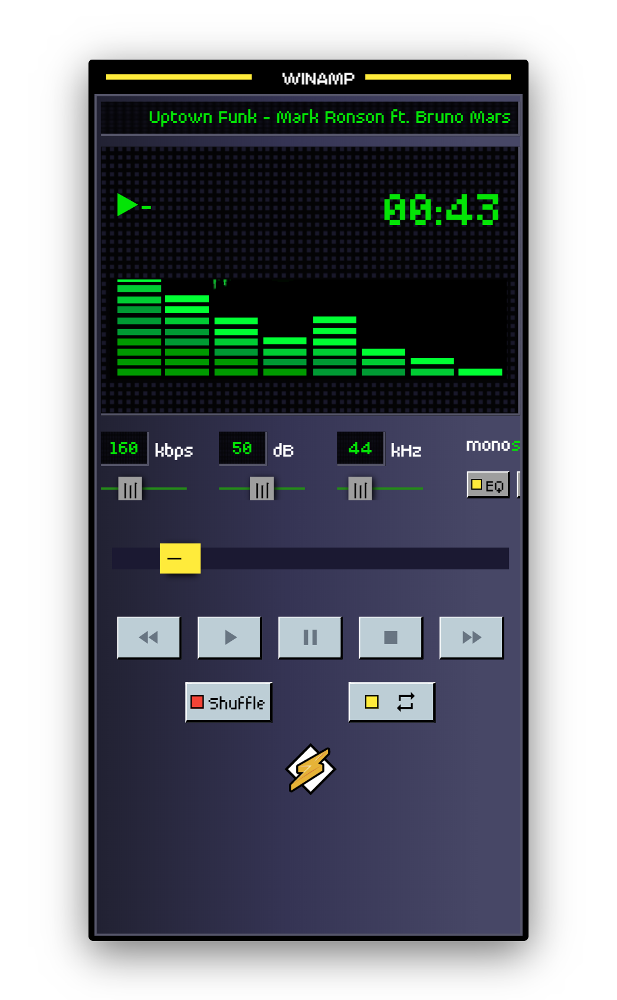
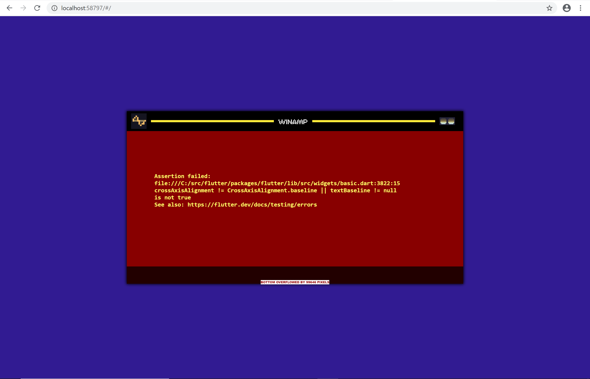

# WinAMP

Almost a decade ago, most of us used **Winamp** for listening to music on our PC devices. It was one of the first music player apps, that was compatible with most modern file types mp3, mp4, avi etc and it featured a wide variety of amazing skins, along with a radio and a browser.

This is just a small attempt to recreate that same experience using @flutter .

### DEMO LINK : 

<pre><a href="https://winamp.ishandeveloper.com">winamp.ishandeveloper.com</a></pre>

### Screenshots
Hell, even the errors look impressive :D

##### Made with ♥ by <a href="https://github.com/ishandeveloper">ishandeveloper</a>

